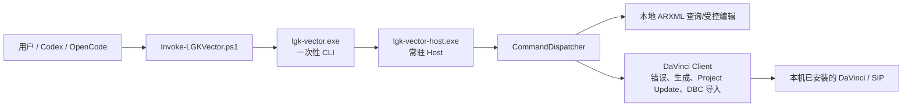

# LGK-Vector 对话衔接与项目现状

> 用途：本文件供新的 Agent 对话、维护者或接手人快速恢复上下文使用。
> 开始任何修改前，先完整阅读本文件、根目录 `AGENTS.md`、`SKILL.md`，再检查 Git 状态。
>
> 本文记录截至 2026-08-15、公开版本 `v0.3.5` 的状态。若后续版本已更新，
> 以 `CHANGELOG.md`、Git 标签和最新测试结果为准，并在完成新工作后更新本文。

## 1. 当前目标与已完成结果

LGK-Vector 是一个开源的本地桥接工具：它复用使用者电脑上已经合法安装的
Vector DaVinci Configurator 与 SIP，对 AUTOSAR ECUC 工程执行查询、受控修改、
错误读取、模块生成、Project Update、DBC 导入和常驻 Host 正常关闭。

工具本身不包含 DaVinci、SIP、许可证、客户 DPA/ARXML/DBC、客户生成代码或任何
专有 Vector 文件。它不绑定 TC275、S32、瑞萨或某一个 MCU；模块定义路径通过目标
工程实际 ECUC/BSWMD 内容发现。

本轮已经完成的关键目标：

1. 建立并公开了独立的 LGK-Vector Rust 源码、测试、文档、CI 和 Release 工作流。
2. 将源码仓库与普通使用者下载包彻底分离：源码完整，Release 极简。
3. 支持 Codex、OpenCode、Claude Code 与其他能够读取说明、执行 PowerShell 的 Agent。
4. 将 Release 包内给用户看到的说明、自检提示和双击入口中文化。
5. 修复 Windows PowerShell 5.1 读取中文自检脚本时的 UTF-8 无 BOM 解析问题；
   自检 PowerShell 脚本现在必须使用 UTF-8 BOM，且已有回归守卫。
6. 已推送公开仓库与标签 `v0.3.5`。GitHub tag 工作流会重新构建并上传极简 Windows ZIP。
7. `v0.3.5` 之后的待发布维护会让 PowerShell 包装器在启动 Host 前拒绝含变更函数的多项数组，并把严格模式前置；这些提交不会改变已发布二进制或标签。

## 2. 两份仓库与职责边界

### 2.1 中央维护源码仓库

- 路径：`D:\Tools\LGK-Vector`
- 当前分支：`codex/open-source-readiness`
- 本轮最后一次提交：`a3d87a5 Localize release self-test output`
- 作用：开发、构建 Rust、运行测试、生成本地候选 Release 包。

这是本机 Codex Skill 的共享源码位置。不要把它复制进每个 AUTOSAR 工程；不同工程
只需要各自 Cfg 目录中的 `lgk-vector.json`。

### 2.2 公开快照仓库

- 路径：`D:\Tools\LGK-Vector-Public`
- GitHub：`https://github.com/qudh666666-web/LGK-Vector`
- 当前分支：`main`
- 当前公开提交：`cc12880 Localize release self-test output`
- 最新公开标签：`v0.3.5`

这个仓库使用独立、干净的公开历史。不要把中央维护仓库的完整历史直接推送到
GitHub；发布时只将经过公开内容守卫验证的当前文件同步到该公开快照仓库。

### 2.3 AUTOSAR 项目仓库

LGK-Vector 工具源码不应被提交到业务 AUTOSAR 项目。业务工程只提交其自身的：

- DaVinci ECUC 配置变化；
- DaVinci 生成后确实需要同步的 C/H/LSL；
- 业务 Callout、回调桩和人工维护文件；
- 项目本身的说明与配置。

不要把 `Debug` 下 `.o/.elf/.hex/.map` 反向同步为配置，也不要因为使用工具而批量覆盖
无关生成目录。涉及现有 AUTOSAR 工程时，先读取该工程自己的规则和 Git 状态。

## 3. 当前目录结构

### 3.1 源码仓库结构（给维护者）

```text
LGK-Vector/
├─ src/                         Rust CLI、Host、ECUC 查询与 DaVinci 调度代码
├─ scripts/                     正式 PowerShell 入口、初始化器、Release 打包器
├─ tests/                       唯一的源码测试根目录
│  ├─ local_ops.rs              Rust 集成测试
│  ├─ onboarding/               首次使用与发布包端到端测试
│  ├─ open-source/              内容、历史、许可证、打包守卫
│  └─ release/                  面向 Release 的 EXE 自检源文件
├─ assets/release-package/      极简 Release 专用中文 README/SKILL/AGENTS 模板
├─ docs/                        维护、接入与本交接说明
├─ .github/workflows/           CI 与 tag 发布工作流
├─ SKILL.md                     Codex/维护者的完整规则
├─ AGENTS.md                    跨 Agent 的源码仓库规则
├─ Cargo.toml / Cargo.lock
└─ CHANGELOG.md
```

源码根目录只保留 `tests/`，不要重新创建第二个顶层 `test/`。`tests/release/`
由打包器映射为下载包里的 `test/`。

### 3.2 极简 Release 技能包结构（给普通使用者）

```text
LGK-Vector-skill/
├─ README.md                    中文安装与首次使用说明
├─ LICENSE
├─ NOTICE
├─ lgk-vector/                  需要整体复制到 Agent skills 目录的运行时目录
│  ├─ lgk-vector.exe
│  ├─ lgk-vector-host.exe
│  ├─ lgk-vector-pair.json
│  ├─ Invoke-LGKVector.ps1
│  ├─ Initialize-LGKVectorProject.ps1
│  ├─ SKILL.md                  中文运行规则
│  └─ AGENTS.md                 中文跨 Agent 规则
└─ test/
   ├─ 一键测试EXE.cmd
   ├─ Run-ExeSelfTest.ps1
   └─ README.md
```

Release 包**故意不含**：`src/`、`tests/`、`docs/`、`.github/`、Cargo 文件、Git
元数据和长篇维护说明。普通使用者不需要 Rust 环境。

## 4. Agent 接入方式

将 Release 中完整的 `lgk-vector` 文件夹复制到目标位置，不能只复制某一个 EXE。

| Agent | 工程级目录 | 全局目录 |
| --- | --- | --- |
| Codex | `<工程目录>\.codex\skills\lgk-vector` | `%USERPROFILE%\.codex\skills\lgk-vector` |
| OpenCode | `<工程目录>\.opencode\skills\lgk-vector` | `%USERPROFILE%\.config\opencode\skills\lgk-vector` |
| Claude Code | `<工程目录>\.claude\skills\lgk-vector` | `%USERPROFILE%\.claude\skills\lgk-vector` |

安装后建议新开对话，并对 Agent 说“使用 lgk-vector skill 处理当前 DaVinci ECUC
任务”。不支持原生 Skill 的 Agent：要求它先读取 `lgk-vector/AGENTS.md` 和
`lgk-vector/SKILL.md`，再调用同目录 PowerShell 脚本。

每个 DaVinci 工程的 Cfg 目录只放自己的 `lgk-vector.json`，最小内容为：

```json
{
  "tool_path": "D:\\VectorSIP"
}
```

首次接入命令：

```powershell
& ".\Initialize-LGKVectorProject.ps1" `
  -ProjectPath "D:\\Work\\Vehicle\\Cfg" `
  -ToolPath "D:\\VectorSIP"
```

日常调用命令：

```powershell
& ".\Invoke-LGKVector.ps1" `
  -ProjectPath "D:\\Work\\Vehicle\\Cfg" `
  -Request '{"func":"find_module","module":"Com"}'
```

最后必须通过同一包装器执行：

```powershell
& ".\Invoke-LGKVector.ps1" `
  -ProjectPath "D:\\Work\\Vehicle\\Cfg" `
  -Request '{"func":"shutdown_host"}'
```

## 5. 运行原则与当前接口

正式函数：

```text
inspect_ecuc_containers
find_module
find_module_template
get_param_definition
locate_container
edit_file
get_errors_list
auto_solve_errors
generate_code
update_project
import_dbc
shutdown_host
```

核心规则：

1. 先查询、后修改；不要猜模块、container、定义引用或行号。
2. 修改 ECUC 前，保存并关闭同一个 DaVinci GUI 工程，避免 GUI 内存模型覆盖磁盘改动。
3. `edit_file` 必须是范围最小的修改，并携带刚读取到的精确 `expected` 原文。
4. `edit_file`、`import_dbc`、`update_project`、`auto_solve_errors`、
   `generate_code`、`shutdown_host` 必须单独请求，不能与其他操作混批。
5. 只生成受影响模块；`module:"all"` 仅在明确要求全量生成时使用。
6. `auto_solve_errors` 前必须取得最新错误列表，并等待用户明确确认，同时请求中传
   `confirmed:true`。
7. `generate_code` 失败后才读取对应模块的 `get_errors_list`；不要盲目重试或全量生成。
8. 所有会话结束时使用 `shutdown_host`；不要以 kill/taskkill/Stop-Process 作为正常关闭。
9. 报告时明确区分：ECUC 配置改动、生成的 C/H/LSL、业务手写代码、编译产物。

## 6. Release 打包实现与重要细节

打包脚本：`scripts/Sync-LGKVectorPackage.ps1`。

它只复制以下内容：

- 根目录：`README.md`、`LICENSE`、`NOTICE`；
- `assets/release-package/` 中的中文模板，映射为 `lgk-vector/README/规则`；
- 两个运行脚本，映射为 `lgk-vector/`；
- `target/release` 中匹配的一对 CLI/Host EXE；
- 自动生成的 `lgk-vector-pair.json`（两个 EXE 的 SHA-256 配对）；
- `tests/release/`，映射为用户可见的 `test/`。

脚本会拒绝把 DPA、ARXML、DBC、日志、许可证文件、密钥、客户配置、额外 EXE 等带进
包中。它还依赖 Git 公共候选清单，避免忽略文件或未跟踪客户文件被递归复制进 Release。

路径兼容点：`Invoke-LGKVector.ps1` 与 `Initialize-LGKVectorProject.ps1` 现在先寻找
“脚本同目录”的 `lgk-vector.exe`，再兼容源码目录的旧布局。因此 Release 的
`lgk-vector/` 目录可以直接作为 Agent Skill 使用。

编码兼容点：`tests/release/Run-ExeSelfTest.ps1` 使用 UTF-8 BOM。原因是 Windows
PowerShell 5.1 对无 BOM 的 UTF-8 中文脚本可能按本地代码页解析，导致 here-string
和 JSON 解析错误。不得把这个文件机械转换为无 BOM UTF-8。

## 7. 构建、测试与发布流程

### 7.1 本机构建

在 `D:\Tools\LGK-Vector` 中执行：

```powershell
& .\scripts\Build-LGKVector.ps1
cargo test --all-targets --locked
& .\tests\open-source\Invoke-DependencyLicenseGuard.ps1
& .\tests\open-source\Invoke-OpenSourceGuard.ps1
& .\tests\open-source\Invoke-PackageManifestSmoke.ps1
& .\tests\onboarding\Invoke-OnboardingSmoke.ps1
```

`Build-LGKVector.ps1` 是修改 Rust 源码后重新生成 EXE 的唯一入口。它使用
`D:\Tools\LGK-Vector\.toolchain` 中已有的私有组件，并在当前 PowerShell 进程显式指定
`dlltool.exe`；默认离线，不安装、不修改系统 Rust、MSYS2、DaVinci 或环境变量。只有提示
Rust 依赖缓存缺失且用户明确允许联网时，才使用 `& .\scripts\Build-LGKVector.ps1 -AllowNetwork`。
成功后检查 `target\release\lgk-vector.exe` 与 `lgk-vector-host.exe`，再执行打包和 EXE 自检。

真实 DaVinci 生成不能由公开合成测试替代；需要使用合法、匹配、可丢弃的本地工程单独
验证。静态 doctor 只验证路径、配置和请求形状，不会启动 DaVinci，也不代表生成一定成功。

### 7.2 Release 候选包

当前本地最新候选包：

```text
D:\Tools\LGK-Vector\dist\LGK-Vector-skill-v0.3.5-windows-x64-c8e5a71-zh.zip
SHA-256: A2711CB6203213FB77470B12EB30C7B346D599E669638D40DCF698F13B3B09A0
```

它包含 `lgk-vector 0.3.5 protocol=2 build=c8e5a71`，运行自检 11 项通过。
名称中的 `-zh` 仅用于本地候选包区分；GitHub v0.3.5 工作流发布的正式资产名称会是
`LGK-Vector-skill-v0.3.5-windows-x64.zip`。

不要把此前 v0.3.1～v0.3.4 的本地候选 ZIP 当作最新交付物。它们是历史测试产物，保留
在 `dist/` 且被 Git 忽略，不应推送到源码仓库。

### 7.3 公开发布

1. 在中央源码仓库完成变更、测试和提交。
2. 只同步任务涉及的文件到 `D:\Tools\LGK-Vector-Public`。
3. 在公开仓库运行公开内容守卫（带 `-IncludeHistory`）、打包守卫、onboarding。
4. 检查 `git diff --cached --check`，只暂存本次文件。
5. 提交 `main`，创建与 `Cargo.toml` 版本相同的标签，例如 `v0.3.5`。
6. 推送 `main` 与标签。`.github/workflows/release.yml` 将在 GitHub Windows Runner 上
   重新执行格式检查、Clippy、Rust 测试、公开守卫、打包、onboarding，并创建 GitHub Release。

注意：发布工作流现在产生极简 `LGK-Vector-skill-<tag>-windows-x64.zip`，不是源码包。
新的 Agent 若要确认线上资产是否已经出现，应检查 GitHub Actions/Release 页面；不要假设
tag 已推送就等于线上构建已经成功。

## 8. 已验证事实与边界

截至本文写入时已实际验证：

- `v0.3.5` 后的包装器维护已通过 5 个受影响 PowerShell 文件的语法解析、13 项打包守卫、46 项 onboarding 断言与 11 项 Release EXE 自检；新增覆盖确认变更函数不能出现在多项数组中，且拒绝发生在 Host 启动前。
- Rust：10 个单元测试 + 17 个 `local_ops` 集成测试通过；
- `Invoke-PackageManifestSmoke.ps1`：12 项断言通过；
- `Invoke-OnboardingSmoke.ps1`：43 项断言通过；
- 极简中文 ZIP 的 `Run-ExeSelfTest.ps1`：11 项断言通过；
- 自检输出已含中文说明；
- 32483、32484 两个 LGK Host 端口已释放；
- 中央源码仓库和公开快照仓库在本轮完成时均无未提交改动。

仍然存在并应如实说明的边界：

- 本机当前命令环境未发现 `cargo`，因此这轮包装器维护未在本机重新运行 Rust 格式、Clippy、测试、构建及依赖许可证守卫；中央维护仓库的私有历史也会使公开历史守卫按设计失败。发布前应在可用 Rust 环境的公开快照仓库补齐完整第 7 节检查；
- 公开测试使用合成 DPA/ECUC/SIP 夹具，不能证明每个 DaVinci、SIP、许可证组合都可生成；
- `doctor.valid=true` 是静态预检成功，不是 DaVinci 已启动或真实生成成功；
- 真实 DBC 导入、Project Update、生成和自动求解在客户工程上有副作用，应遵循先备份、
  保存关闭 GUI、最小范围、单独请求、生成后检查、正常关闭 Host 的流程；
- 不要把公司工程、客户文件、专有脚本、许可证或二进制上传到公开仓库。

## 9. 下一段对话建议先做什么

根据用户目标选择以下之一：

1. **检查发布是否完成：** 打开 GitHub Release 与 Actions，确认 `v0.3.5` 工作流通过，
   资产名称、版本和 ZIP 内容正确。
2. **让新电脑安装：** 让用户下载正式 ZIP，将其中完整 `lgk-vector/` 复制到所用 Agent
   的 skills 目录，双击 `test/一键测试EXE.cmd`，再接入一个可丢弃 DaVinci 工程。
3. **真实工程操作：** 先读取目标工程 Git 状态与目标 Cfg 中 `lgk-vector.json`，按
   `SKILL.md` 做最小查询、最小修改、单模块生成和 `shutdown_host`。
4. **继续维护工具：** 阅读本文件、`AGENTS.md`、`SKILL.md`、`CHANGELOG.md` 和相关测试，
   只改用户明确指定的问题，更新测试与更新记录后走第 7 节流程。

## 10. 脚本与源码实现导读（维护者必读）

这一节解释“工具到底是怎样写出来、一次请求经过哪些代码”的问题。它不是 API
清单的重复；新接手人应按这里的顺序打开源码，先理解边界，再改功能。

### 10.1 一次请求的完整流向



前四层解决的是路径、编码、进程、版本配对、并发和会话生命周期；它们**不**直接
修改 ECUC。实际的 ECUC 查询与窄范围编辑在 Rust 的 `ops/`、`vector/` 中完成；需要
DaVinci 的功能才由 `daemon/` 启动或复用 DaVinci 会话。这样普通查询不会因 DaVinci
冷启动而变慢，生成类操作也不会被伪装成纯文本修改。

### 10.2 PowerShell 脚本：先从这四个文件读起

#### `scripts/Invoke-LGKVector.ps1`：唯一的日常入口

这是人和各类 Agent 都应调用的包装器。它不解析 ARXML，也不自己拼 DaVinci 命令；它
负责把输入变成一个可靠的本地 CLI 调用。

代码阅读顺序和实际流程如下：

1. `param(...)` 定义 `ProjectPath`、内联 `Request` 或 `RequestFile`、可选
   `ExecutablePath` 和 `ValidateOnly`。内联请求与文件请求是两个参数集，避免两种来源
   同时生效。
2. 用 `$MyInvocation.MyCommand.Path` 得到脚本位置，而不是只依赖 `$PSScriptRoot`。
   这是为 Windows PowerShell 的某些 `-File` 启动方式准备的：后者可能为空。随后按
   “脚本同目录 EXE → 兼容旧布局的上一级 EXE → 源码 `target\release`”寻找 CLI。
3. 明确设置 UTF-8 无 BOM 的控制台输入、输出和 `$OutputEncoding`。它避免中文路径、
   DaVinci 诊断和 JSON 经 PowerShell 重定向时变码。
4. `Get-BridgeIdentity` 分别执行 CLI/Host 的 `--version`，并比较版本、协议号、构建
   标识。若 Release 带有 `lgk-vector-pair.json`，再比较两个 EXE 的 SHA-256。这一步防止
   “只替换了一个 EXE”或把不同构建混在一起。
5. 内联 JSON 先由 `ConvertFrom-Json` 校验，再写成工具自己创建的 UTF-8 无 BOM 临时
   文件；这样长 JSON 不会被 Windows 命令行转义损坏。文件请求则仅解析并校验，不重写
   用户文件。
6. 脚本白名单检查 `func`，并在启动 Host 前拒绝多项数组中的变更函数。`-ValidateOnly` 时
   调用 CLI 的 `--doctor` 静态预检；普通请求则先 `--start-host`，再以 `--request-file` 发给
   CLI。`shutdown_host` 是例外：它不会为了关闭而新启动 Host。
7. `finally` 只删除本次脚本创建的临时请求文件，不碰工程、DPA 或用户文件。

因此，想增加一个正式函数时，不能只在 Rust 中实现：还要把函数加入这里的
`$allowedFunctions`（注释已指向 `src/daemon/commands.rs` 中的真实注册位置），并同步更新
`SKILL.md`、测试和 Release 模板。

#### `scripts/Initialize-LGKVectorProject.ps1`：安全地创建工程配置

它接收 `ProjectPath`、`ToolPath`，可选 `ProjectFile` 与 `DavinciCommandPath`，在 Cfg
目录写入最小的 `lgk-vector.json`。关键实现点：

- 已有同名 JSON 时直接拒绝，不覆盖旧配置；
- `Get-PortablePath` 把相对 `ProjectFile` 解释为相对工程目录、相对 DaVinci 命令解释为
  相对 SIP 目录，**不**依赖调用者当前 PowerShell 目录；位于基准目录内的路径存为相对
  路径，工程移动后仍可用；
- JSON 故意不写 `project_path`，Rust 从 JSON 所在目录推导它；
- 文件写完立即通过包装器做 `get_errors_list + -ValidateOnly` 静态预检。该预检失败时，
  只回滚本次刚创建的 JSON，不删除任何既有工程文件。

这里最容易误解的一点是：静态预检通过只说明 JSON、DPA 和 DVCfgCmd 路径可以解析；
它不启动 DaVinci，不能替代一次真实生成验证。

#### `scripts/Install-LGKVectorSkill.ps1`：源码开发者的 Codex 安装器

它不是普通用户下载包的安装方式。这个脚本检查源目录必须具备 `SKILL.md`、`Cargo.toml`、
`src/` 和 `scripts/`，然后默认在 `%USERPROFILE%\.codex\skills\lgk-vector` 创建一个指向
中央源码的 Windows Junction。它接受 `-SkillPath`，注释列出 Codex、Claude Code 与 OpenCode 的
常见位置；目标已经存在且不是指向同一源码时会拒绝，绝不覆盖。

普通使用者不需要此脚本：应整体复制 Release 内的 `lgk-vector/` 文件夹。开发者使用
Junction 的好处是修改源码说明后无需在每个工程反复复制，但前提是本机 Rust/源码环境
完整。

#### `scripts/Sync-LGKVectorPackage.ps1`：极简发布包的白名单打包器

它不做“递归复制整个工程”。`$packageFiles` 是一份显式映射表：只允许许可证、NOTICE、
Release 中文 README/SKILL/AGENTS 模板和两个运行脚本；`tests/release/` 才映射为下载包
里的唯一 `test/`。带 `-IncludeBinaries` 时才额外复制匹配的一对 CLI/Host EXE，并生成
二者哈希的 `lgk-vector-pair.json`。

打包前它运行公开内容守卫，并读取 `git ls-files --cached --others --exclude-standard` 清单。
这意味着被 `.gitignore` 忽略的客户 DPA、ARXML、DBC、日志，即使躺在源码树里也不会因
递归复制误进 ZIP。打包末尾又扫描禁止扩展名和多余 EXE，发现客户配置、密钥、许可证、
生成产物或 `.pdb` 调试符号等立即失败。

### 10.3 Rust 代码分层：从入口到实际操作

| 位置 | 负责什么 | 修改它的典型场景 |
| --- | --- | --- |
| `src/bin/lgk-vector.rs` | 一次性 CLI 参数解析；支持内联 JSON、stdin、请求文件、`--doctor`、`--start-host`；读取时去除 UTF-8 BOM。 | 新增 CLI 开关或请求输入形式。 |
| `src/bin/lgk-vector-host.rs` | 常驻 Host 进程入口，只解析端口和 Token 文件后交给 `app::host`。 | 一般不应放业务功能。 |
| `src/app/cli.rs` | CLI 与 Host 的客户端侧：创建/校验 Token、启动 Host、健康探测、请求锁、175 秒请求预算、关闭后等待端口释放。 | 会话、版本配对、启动或客户端诊断问题。 |
| `src/app/host.rs` | 仅监听 `127.0.0.1`；校验协议和 Token；绑定一个工程；维护 ready/busy/stopping 状态；把请求交给分发器。 | 常驻生命周期、并发、正常关闭或协议问题。 |
| `src/project.rs` | 读取 `lgk-vector.json`，规范化路径，定位/验证唯一 DPA 和 DaVinci 命令，限制写入目标必须在工程内。 | JSON 字段、路径兼容或工程边界规则。 |
| `src/daemon/commands.rs` | 请求函数白名单、批处理形状校验、只读/写操作边界，以及各操作的调度入口。 | 新函数接入、批量规则和副作用限制。 |
| `src/ops/` | 本地、无需 DaVinci 的模块查找、模板/参数定义查询、容器定位、受控文本编辑等。 | 查询结果、编辑精度或本地性能。 |
| `src/vector/` | 解析 SIP/BSWMD/ECUC ARXML 定义、构造真实 definition ref、缓存模板索引。 | 不同 SIP 的定义结构兼容和索引性能。 |
| `src/daemon/client.rs`、`project_update.rs` | 通过 DaVinci 命令/守护端执行错误读取、生成、自动求解、Project Update 与 DBC 导入，并将失败转为失败结果。 | DaVinci 自动化协议、生成/导入行为。 |

最小的程序入口链是：

```text
lgk-vector.exe
  -> app::cli::run
  -> 本机 TCP HostRequest（协议号 + Token + 原始 JSON + 工程配置）
  -> app::host::run
  -> CommandDispatcher::dispatch_batch
  -> ops/ 或 daemon/
```

Host 不以“端口能连通”判断可用：CLI 会用独立探测端口检查 Token、协议、版本和构建标识，
并能得到 `ready`、`busy`、`stopping`。业务请求期间使用同安装目录的请求锁，避免第二个
写/生成请求在调用方超时后仍排队执行。Host 收到 `shutdown_host` 后先进入 stopping，关闭
DaVinci Dispatcher，再释放两个端口；关闭请求不依赖仍能解析旧工程 JSON，因此用户更新
配置后也可以正常关掉旧 Host。

### 10.4 怎么增加或修改一个功能：按影响面走，不要只改一个点

以“新增一个只读查询函数”为例，通常应依次检查：

1. 在 `src/ops/` 实现基于真实文件的操作，并为不合法输入返回明确错误；
2. 在 `src/daemon/commands.rs` 注册函数、分类为只读或写操作，并遵守批处理规则；
3. 在 `scripts/Invoke-LGKVector.ps1` 的白名单加入函数；
4. 在源码 `SKILL.md`、`AGENTS.md` 说明请求 JSON、前置条件和输出；若普通用户需要它，
   同步 `assets/release-package/SKILL.md`、`AGENTS.md`；
5. 新增/更新 Rust 测试；必要时补 onboarding 或 Release 自检；
6. 运行第 7 节对应检查，再确认打包产物仍是极简结构。

如果是写入、导入、生成或自动求解功能，还必须额外确认：目标文件必须位于工程范围内、
调用不可与其他请求混批、DaVinci GUI 在编辑前已保存关闭、失败不会被包装成成功输出、
完成后可通过 `shutdown_host` 正常结束会话。

### 10.5 排错时先定位到哪一层

| 现象 | 先看什么 | 常见原因 |
| --- | --- | --- |
| 双击 `一键测试EXE.cmd` 立即报 PowerShell 解析错 | `tests/release/Run-ExeSelfTest.ps1` 编码与包内路径 | 中文脚本被保存为无 BOM；不要改成 ANSI 或无 BOM UTF-8。 |
| “CLI/Host identities do not match” | 同目录两个 EXE、`lgk-vector-pair.json` | 混用了不同版本或只覆盖一个 EXE；整体重新复制 `lgk-vector/`。 |
| `doctor` 通过但生成失败 | `daemon/client.rs`、DaVinci 日志、DVCfgCmd 路径 | doctor 本来只是静态预检；实际 DaVinci/SIP/许可证/工程错误仍会失败。 |
| Host busy / stopping / 端口不兼容 | `app/cli.rs`、`app/host.rs` | 另一请求尚未完成、正在关闭，或端口被其他程序/旧构建占用。 |
| 查不到模块或参数定义 | `src/vector/`、目标 SIP 的 BSWMD/ARXML | 定义真实路径、Choice 容器结构或 SIP 内容与假设不同。 |
| DBC 导入/Project Update 异常 | `daemon/project_update.rs`、请求 JSON、目标工程副本 | 这是 DaVinci 有副作用操作；先使用可丢弃副本并保留错误输出。 |

维护时优先运行最贴近修改点的测试，再运行第 7 节完整守卫。不要通过“看起来能编译”
来代替 Release 自检；也不要通过“请求返回一段文本”来断言 DaVinci 已成功生成。

## 11. 给新对话直接粘贴的衔接词

```text
请先完整读取并遵守：
D:\Tools\LGK-Vector\docs\对话衔接与项目现状.md

当前要继续维护/使用 LGK-Vector。工具源码目录是 D:\Tools\LGK-Vector，
公开仓库目录是 D:\Tools\LGK-Vector-Public，公开 GitHub 仓库是
https://github.com/qudh666666-web/LGK-Vector 。

请先重点阅读本交接文档第 10 节“脚本与源码实现导读”，再读取
D:\Tools\LGK-Vector\SKILL.md、根目录 AGENTS.md，检查两份仓库的 Git
状态；保留用户改动，不要 reset、clean 或覆盖无关文件。涉及 Vector DaVinci ECUC 时，
使用 LGK-Vector 的 PowerShell 包装器和 shutdown_host 正常关闭常驻 Host，不要手改 ARXML。

当前公开版本为 v0.3.5，Release 是极简中文技能包。请根据我接下来的具体任务继续，
并在完成后更新 CHANGELOG、测试和本交接文档中受影响的部分。
```

如果新对话只需要安装或测试 Release，可用更短版本：

```text
请读取 D:\Tools\LGK-Vector\docs\对话衔接与项目现状.md 的第 3、4、6、7、8、10 节，
然后帮我继续处理 LGK-Vector v0.3.5 的安装/发布/测试问题。不要修改 AUTOSAR 客户工程。
```
